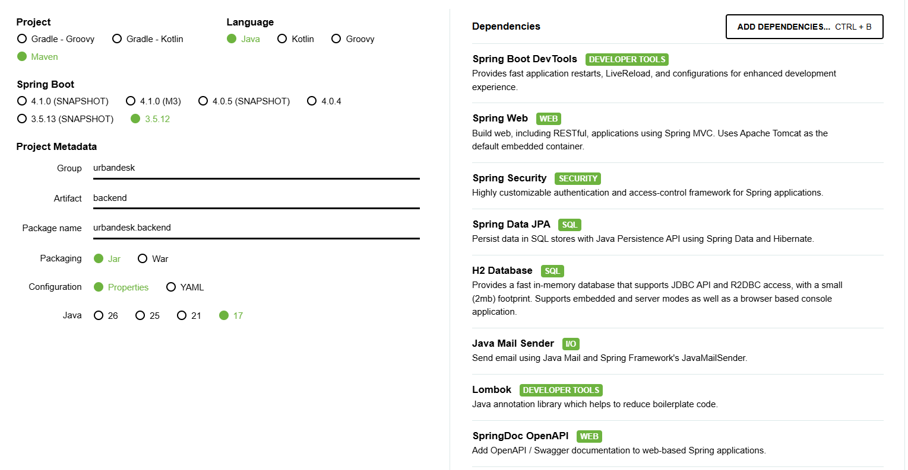

# UrbanDesk

Minimum Viable Product of the Urban Incidents Manager project (Group 8)

## Start Frontend

To start the frontend application, follow these steps:

1. Open a terminal in the root directory.
2. Navigate to the frontend folder:
   ```bash
   cd Code/frontend
   ```
3. Install the dependencies:
   ```bash
   npm install
   ```
4. Start the development server:
   ```bash
   npm run dev
   ```
5. Open your browser and navigate to the URL shown in the terminal (usually `http://localhost:5173`).

## Backend

### Needed Dependencies
It's necessary to install java 17, here is a link to download the recomended version `OpenJDK 17.0.18`

``` https://learn.microsoft.com/es-es/java/openjdk/download ```

### Project Dependencies
Here is an image of the depencencies included in the Spring project



### Start backend

1. Open a terminal in the root directory

2. Navigate to the frontend folder:
   ```bash
   cd Code/backend
   ```
3. Start the backend:
   **In Windows:**

    ```powershell
    .\mvnw.cmd spring-boot:run
    ```

    **In Linux/Mac:**

    ```bash
    ./mvnw spring-boot:run
    ```

    The app will start in port **8080** by default